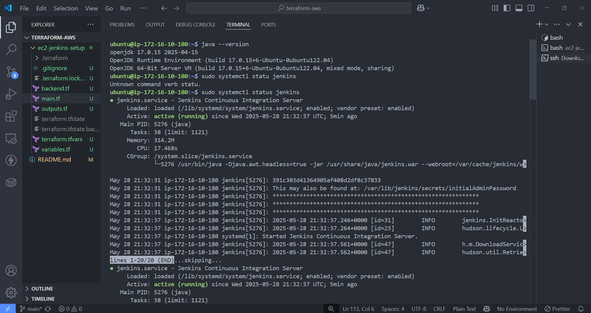
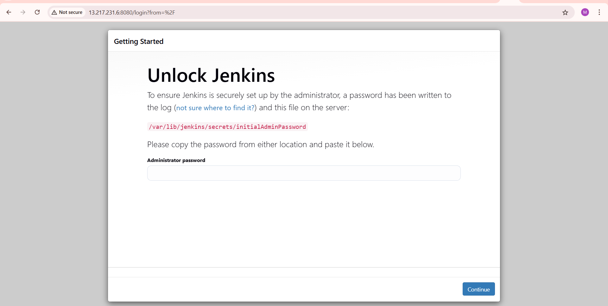
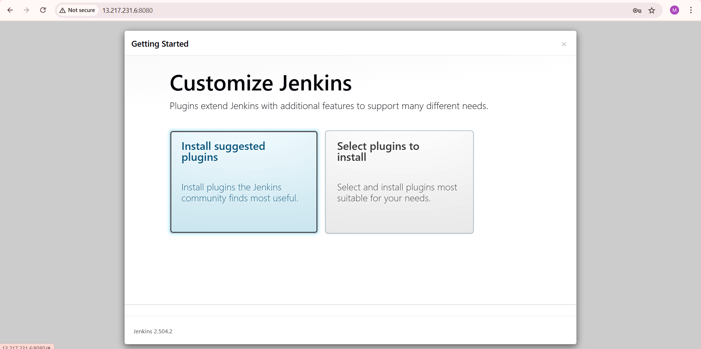
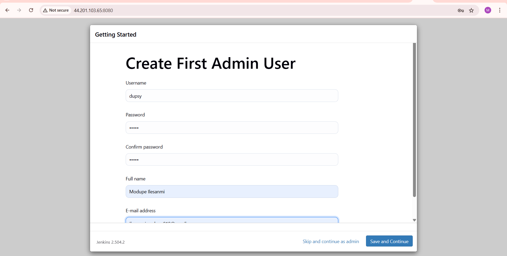
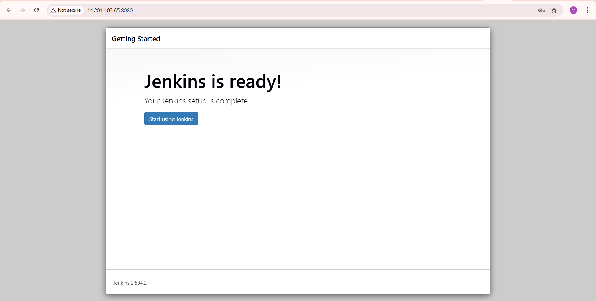
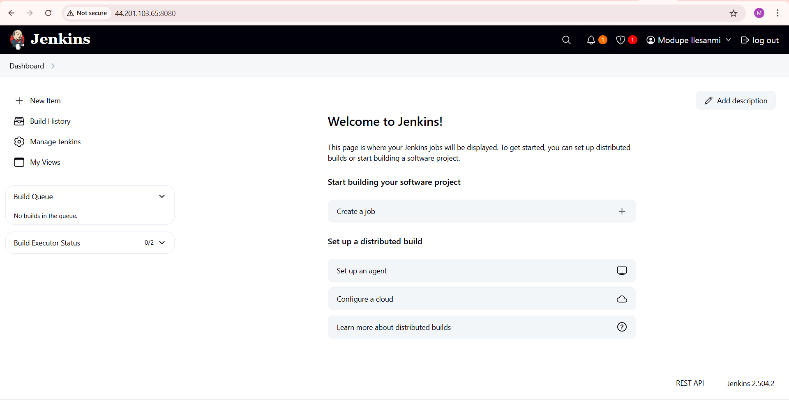

# 📸 Jenkins Setup Preview Gallery

This folder contains screenshots of the Jenkins setup process as deployed via Terraform on AWS EC2.

The images below preview key steps and screenshots during installation and configuration.

---

## 🔍 Preview

### Jenkins Status: Active (Running)

### Getting Started Wizard

### Create Admin User

### Jenkins is Ready

### Jenkins Dashboard

---
